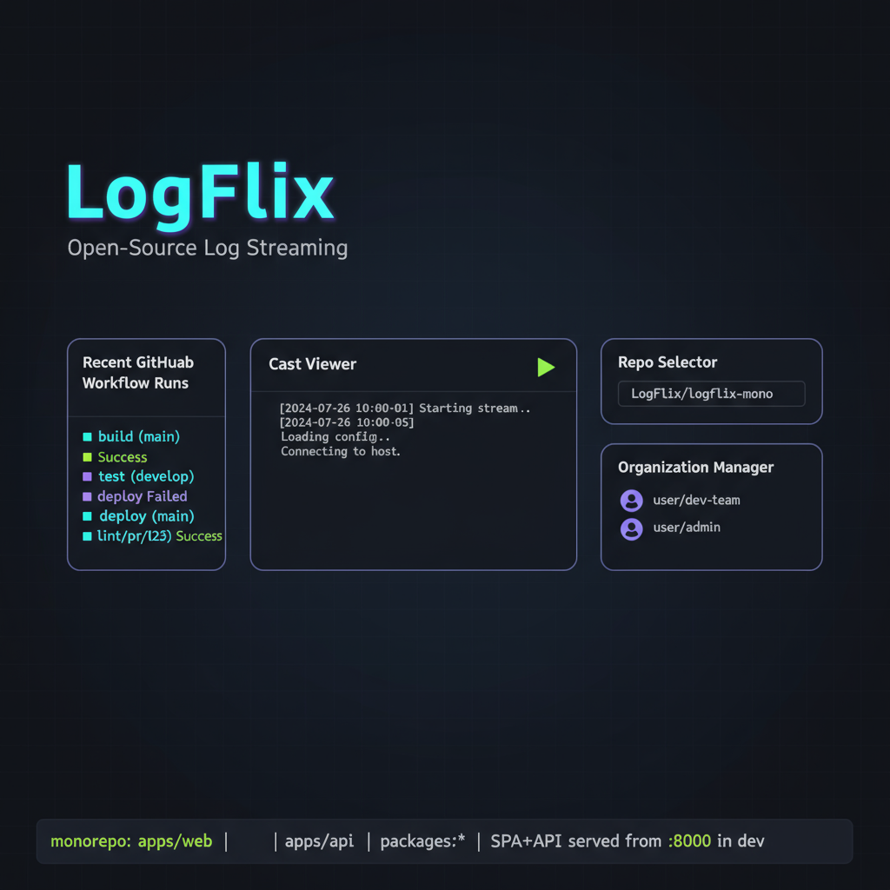

# LogFlix



LogFlix is a lightweight PR observability UI for GitHub: browse PRs, drill into workflow runs, and flip between Overview, Terminal, Logs, Files, and Comments — all in one obersavibility tool.

Live: https://logflix.vercel.app

## Features

- Multiple organization support powered by Clerk + Github SSO.
- Authenticate via your Github account to get repos you own or collaborate on in your organization.
- PR explorer: search and browse pull requests.
- Tabs per PR:
  - Overview: task details, agent results, PR metadata, quick link to view on GitHub.
  - Terminal: interactive terminal playback.
  - Logs: streaming structured logs with levels and timestamps.
  - Files: browse/download artifacts and cast files.
  - Comments: view discussion in context.

## Quickstart (local development)

Requirements: Node 18+, PNPM.

1. Install dependencies:
   ```sh
   pnpm install
   ```
2. Copy env and set secrets:
   ```sh
   cp .env.example .env
   # Generate a strong session secret
   openssl rand -base64 32
   # Edit .env and set SESSION_SECRET
   # Optionally set VITE_CLERK_PUBLISHABLE_KEY and CLERK_SECRET_KEY to enable auth
   ```
3. Run the app (single port for API + SPA):
   ```sh
   pnpm dev
   # open http://localhost:5001
   ```
   Or run separately:
   ```sh
   pnpm dev:web   # frontend
   pnpm dev:api   # backend
   ```

## Contributing

- Fork and create a feature branch.
- Keep changes small and focused; add clear commit messages.
- Run locally with the steps above; open a PR when ready.

## License

MIT