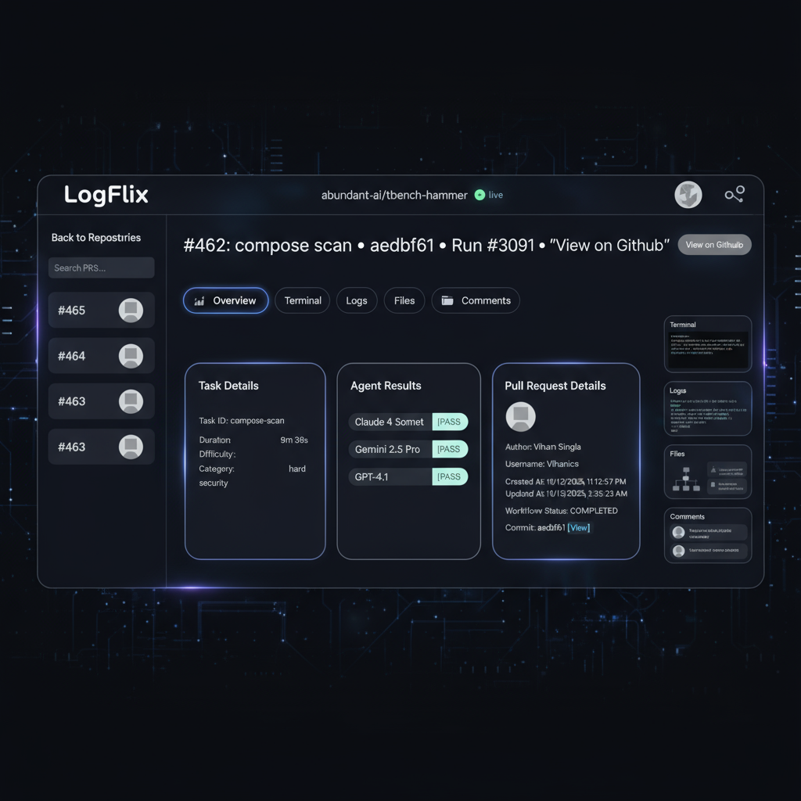

# LogFlix



GitHub workflow and PR explorer for your repositories for the Terminal Bench tasks.

Visualizes workflow runs, logs, and cast artifacts with a clean UI.

Live: https://logflix.vercel.app

## Features
- Explore PRs, workflow runs, jobs, logs, and artifacts
- Cast Viewer for terminal-like recordings from artifacts
- Organization Manager and Repository Selector
- Fine-grained permissions (admin, member) to view repositories you own or collaborate on
```

## Quickstart (local development)

### Requirements
- Node 18 or newer
- PNPM

1. Install dependencies
```sh
pnpm install
```

2. Create and edit env
```sh
cp .env.example .env
# Required
# SESSION_SECRET=... (generate with: openssl rand -base64 32)
# Optional (auth on): VITE_CLERK_PUBLISHABLE_KEY=..., CLERK_SECRET_KEY=...
# Optional: DATABASE_URL=...
```

3. Start one-port dev server
```sh
pnpm dev
# serves API and Vite client on http://localhost:5001
```

Notes
- Without Clerk keys, the app runs in unauthenticated mode with a banner and all routes public
- The API mounts Vite middleware in dev to serve the SPA from the same port [apps/api/index.ts](apps/api/index.ts)

## Build and deploy
- Build client and packages for production
```sh
pnpm build
```
- On Vercel, rewrites route API calls to a serverless function [api/index.ts](api/index.ts) and serves the SPA per [vercel.json](vercel.json)

## Contributing
- Fork and create a feature branch
- Keep changes small and focused
- Run type checks before pushing
```sh
pnpm check
```
- If using the database, set DATABASE_URL and push schema
```sh
pnpm db:push
```

## License
MIT — see [LICENSE.md](LICENSE.md)